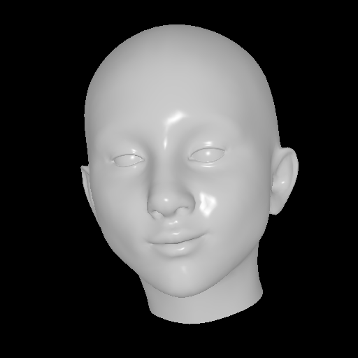
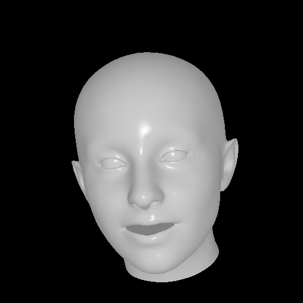

# OBJ_Render
A tool that can render 3D face obj file into 2D images

## How to use it
```
git clone https://github.com/LTT-O/OBJ_Render.git
sh install_pytoch3d.sh
python render.py --obj_path=./demo1.obj --save_path=./demo1.png
```
## Result

